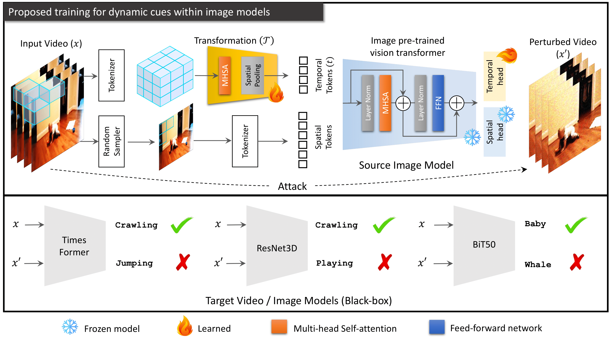

# Boosting Adversarial Transferability using Dynamic Cues (ICLR'23)

[Muzammal Naseer](https://scholar.google.ch/citations?user=tM9xKA8AAAAJ&hl=en),
[Ahmad Mahmood](https://www.linkedin.com/in/ahmad-mahmood-81339a212/),
[Salman Khan](https://scholar.google.com/citations?user=M59O9lkAAAAJ&hl=en), &
[Fahad Khan](https://scholar.google.ch/citations?user=zvaeYnUAAAAJ&hl=en&oi=ao)

[Paper](https://openreview.net/forum?id=SZynfVLGd5) ([arxiv](https://arxiv.org/abs/2302.12252)), [Reviews & Response](https://openreview.net/forum?id=SZynfVLGd5)
#

> **Abstract:** 
*The transferability of adversarial perturbations between image models has been extensively studied. In this case, an attack is generated from a known surrogate \eg, the ImageNet trained model, and transferred to change the decision of an unknown (black-box) model trained on an image dataset. However, attacks generated from image models do not capture the dynamic nature of a moving object or a changing scene due to a lack of temporal cues within image models. This leads to reduced transferability of adversarial attacks from representation-enriched \emph{image} models such as Supervised Vision Transformers (ViTs), Self-supervised ViTs (\eg, DINO), and Vision-language models (\eg, CLIP) to black-box \emph{video} models. In this work, we induce dynamic cues within the image models without sacrificing their original performance on images. To this end, we optimize \emph{temporal prompts} through frozen image models to capture motion dynamics. Our temporal prompts are the result of a learnable transformation that allows optimizing for temporal gradients during an adversarial attack to fool the motion dynamics. Specifically, we introduce spatial (image) and temporal (video) cues within the same source model through task-specific prompts. Attacking such prompts maximizes the adversarial transferability from image-to-video and image-to-image models using the attacks designed for image models. As an example, an iterative attack launched from image model Deit-B with temporal prompts reduces generalization (top1 \% accuracy) of a video model by 35\% on Kinetics-400. Our approach also improves adversarial transferability to image models by 9\% on ImageNet w.r.t the current state-of-the-art approach. Our attack results indicate that the attacker does not need specialized architectures, \eg, divided space-time attention, 3D convolutions, or multi-view convolution networks for different data modalities. Image models are effective surrogates to optimize an adversarial attack to fool black-box models in a changing environment over time. Code is available at \url{https://bit.ly/3Xd9gRQ}.* 
>



#
<hr>

## Main Message & Highlights


1. The attacker does not need specialized architectures, e.g., divided space-time attention, 3D convolutions, or multi-view convolution networks for different data modalities. Image models are effective surrogates to optimize an adversarial attack to fool black-box models in a changing environment over time.

2. We introduce dynamic cues within frozen image models without losing the original image representation (e.g. generalization on ImageNet). Both image and video representations enhance adversarial transferability from our adapted image models. For example, a pre-trained ImageNet ViT with approximately 6 million parameters exhibits 44.6 and 72.2 top-1 (%) accuracy on Kinetics-400 and ImageNet validation sets using our approach.

3. Our approach simply augments the existing adversarial attacks developed for image models to fool video or multi-view models.

4. We analyze three types of training schemes (supervised, self-supervised, and text-supervised) and highlight new insights into the adversarial space of vision-language models.

5. We further anlayze the textual bias within vision-language model, CLIP, for the low adversarial transferability to vision models.

6. We observe highly transferable adversaial space of self-supervised vision transformer models such as DINO. 

#
<hr>

## Citation
If you find our work, this repository, or pretrained image models with temporal prompts useful, please consider giving a star :star: and citation.
```bibtex
@inproceedings{
naseer2023boosting,
title={Boosting Adversarial Transferability using Dynamic Cues},
author={Muzammal Naseer and Ahmad Mahmood and Salman Khan and Fahad Khan},
booktitle={The Eleventh International Conference on Learning Representations },
year={2023},
url={https://openreview.net/forum?id=SZynfVLGd5}
}
```

## Contents

1. [News](#News)
2. [Model Zoo](#Model-Zoo)
   * [Pre-trained Image Models-Supervised](#Pre-trained-Image-Models-Supervised)
   * [Pre-trained Image Models-Self Supervised](#Pre-trained-Image-Models-Self-Supervised)
   * [Pre-trained Image-Language Models-Text Supervised](#Pre-trained-Image-Language-Models-Text-Supervised)

3. [Setup](#Setup)
4. [Training for Dynamic Cues for Videos](#Training-for-Dynamic-Cues-for-Videos)
5. [Training for Dynamic Cues for Multi-Views-ModelNet40](#Training-for-Dynamic-Cues-for-Multi-Views-ModelNet40)
6. [Evaluation](#Evaluation)
7. [Attack Image2Videos](#Attack-Image2Videos)
8. [References](#References)

<hr>

## News

### (January 21, 2023)
* Our paper is accepted as a conference paper at [ICLR 2023](https://openreview.net/forum?id=SZynfVLGd5)


### (February 15, 2023)
* Pretrained weights released.
  * Kinetics-400
    * ```DeiT-tiny``` - 44.6
    * ```DeiT-small``` - 53.0
    * ```DeiT-base``` - 57.0
    * ```Dino``` - 57.4
    * ```Clip``` - 67.3
  * HMDB
    * ```DeiT-tiny``` - 36.2
    * ```DeiT-small``` - 44.6
    * ```DeiT-base``` - 47.7
    * ```Dino``` - 45.1
    * ```Clip``` - 54.6
  * UCF
    * ```DeiT-tiny``` - 70.0
    * ```DeiT-small``` - 77.2
    * ```DeiT-base``` - 81.4
    * ```Dino``` - 79.5
    * ```Clip``` - 86.0
  * SSV2
    * ```DeiT-tiny``` - 11.2
    * ```DeiT-small``` - 15.3
    * ```DeiT-base``` - 17.5
    * ```Dino``` - 17.4
    * ```Clip``` - 19.9
  * Shadow - ModelNet40
    * ```DeiT-tiny``` - 81.0
    * ```DeiT-small``` - 86.2
    * ```DeiT-base``` - 88.2
    * ```Dino``` - 89.8
    * ```Clip``` - 88.9
  * Depth - ModelNet40
    * ```DeiT-tiny``` - 86.0
    * ```DeiT-small``` - 86.6
    * ```DeiT-base``` - 90.1
    * ```Dino``` - 90.1
    * ```Clip``` - 89.5
<hr>

## Model Zoo

### Pre-trained Image Models-Supervised

| Dataset       | Input Size | Model | Pretrained Weights   |
|:--------------|:----------:|:-----:|:--------------------------------------------------------------------------------------------------------------------------:|
|    ImageNet & Kinetics-400    |   224 x 224 & 8x224x224     |  DeiT-tiny  | [Link]()  |
|    ImageNet & Hmdb-51    |   224 x 224 & 8x224x224     |  DeiT-tiny  | [Link](https://pern-my.sharepoint.com/:u:/g/personal/23100146_lums_edu_pk/ES2UNy5M5dNDjm83VoLTg80BuSLKWuSMQPXfn61k9tPDpw?e=fWSveg)  |
|    ImageNet & Ucf-101    |   224 x 224 & 8x224x224     |  DeiT-tiny  | [Link](https://pern-my.sharepoint.com/:u:/g/personal/23100146_lums_edu_pk/EWrBxXHUAyxNtTXJ1-7yG7MBEvEA0e7zrIgeRcNyE2phqQ?e=ZLET9g)  |
|    ImageNet & Ssv2    |   224 x 224 & 8x224x224     |  DeiT-tiny  | [Link]()  |
|    ImageNet & Kinetics-400    |   224 x 224 & 8x224x224     |  DeiT-small  | [Link]()  |
|    ImageNet & Hmdb-51    |   224 x 224 & 8x224x224     |  DeiT-small  | [Link](https://pern-my.sharepoint.com/:u:/g/personal/23100146_lums_edu_pk/EaHIsp0w3uhNm93NLdJxNW4B1nOHuX1dbtqNegj7wuIpgA?e=Lq3umH)  |
|    ImageNet & Ucf-101    |   224 x 224 & 8x224x224     |  DeiT-small  | [Link](https://pern-my.sharepoint.com/:u:/g/personal/23100146_lums_edu_pk/Ef6x5dJi_yxPsBJFB7YgAbQBqXcAeoYX4ROZ6kfWmHnKXg?e=T6HYJg)  |
|    ImageNet & Ssv2    |   224 x 224 & 8x224x224     |  DeiT-small  | [Link]()  |
|    ImageNet & Kinetics-400    |   224 x 224 & 8x224x224     |  DeiT-base  | [Link]()  |
|    ImageNet & Hmdb-51    |   224 x 224 & 8x224x224     |  DeiT-base  | [Link](https://pern-my.sharepoint.com/:u:/g/personal/23100146_lums_edu_pk/EYNXafkuhHxGoY3Ni5QKhg0BvU9SV9iZQeYW4Elz-7jKxg?e=TuGkQL)  |
|    ImageNet & Ucf-101    |   224 x 224 & 8x224x224     |  DeiT-base  | [Link](https://pern-my.sharepoint.com/:u:/g/personal/23100146_lums_edu_pk/EeUDYxVTxqFBuP8bORPyDq8Bk3t9z-m9U41Uz6Hdrv6HxQ?e=n5Jp0Y)  |
|    ImageNet & Ssv2    |   224 x 224 & 8x224x224     |  DeiT-base  | [Link]()  |


### Pre-trained Image Models-Self Supervised

| Dataset       | Input Size | Model | Pretrained Weights   |
|:--------------|:----------:|:-----:|:--------------------------------------------------------------------------------------------------------------------------:|
|    ImageNet & Kinetics-400    |   224 x 224 & 8x224x224     |  Dino | [Link](https://pern-my.sharepoint.com/:u:/g/personal/23100146_lums_edu_pk/EbUDvMjJLbpFm6ol0dz-50MBQVexWdMGlgQJrLsjVRPrCw?e=GNcH0A)  |
|    ImageNet & Hmdb-51    |   224 x 224 & 8x224x224     |  Dino  | [Link](https://pern-my.sharepoint.com/:u:/g/personal/23100146_lums_edu_pk/ET3IuaTiLORPm_Nsv3BfuIwBZoDkFnKtCXK_uLZLbCIYWA?e=x4McbC)  |
|    ImageNet & Ucf-101    |   224 x 224 & 8x224x224     |  Dino  | [Link](https://pern-my.sharepoint.com/:u:/g/personal/23100146_lums_edu_pk/ESnv3dAQb-1Gr16GPCUSwBUBKK1yyn_qG8e-KHDQRvlIow?e=Wt7PG1)  |
|    ImageNet & Ssv2    |   224 x 224 & 8x224x224     |  Dino  | [Link](https://pern-my.sharepoint.com/:u:/g/personal/23100146_lums_edu_pk/Eb_YTZ6XnixLo59QqU39GMUBh1xn8XWMPqy5PyBIwZYsqw?e=XFb01V)  |

### Pre-trained Image-Language Models-Text Supervised

| Dataset       | Input Size | Model | Pretrained Weights   |
|:--------------|:----------:|:-----:|:--------------------------------------------------------------------------------------------------------------------------:|
|    ImageNet & Kinetics-400    |   224 x 224 & 8x224x224     |  Clip | [Link]()  |
|    ImageNet & Hmdb-51    |   224 x 224 & 8x224x224     |  Clip  | [Link](https://pern-my.sharepoint.com/:u:/g/personal/23100146_lums_edu_pk/EWFJuWYdyJJOrLSOOiAqohoBv5NeVrykugwNbpdvhPQLNQ?e=ZsD8Iq)  |
|    ImageNet & Ucf-101    |   224 x 224 & 8x224x224     |  Clip  | [Link](https://pern-my.sharepoint.com/:u:/g/personal/23100146_lums_edu_pk/Ee8uTaSobRVHjYFAyOgdcQsBBulEwTR4cN9CQ4HiXbBXwQ?e=ED8cg7)  |
|    ImageNet & Ssv2    |   224 x 224 & 8x224x224     |  Clip  | [Link]()  |

<hr>

## Setup the environment
### Build the codebase and environment

```
git clone https://github.com/Muzammal-Naseer/DCViT-AT
cd DCViT-AT
conda env create -n [name] --file environment.yml
conda activate [name]
python setup.py build develop
```
## Dataset Preparation
See details in md file

## Training for Dynamic Cues for Videos
The folder [Dynamic_Cues](/Dynamic_Cues) contains all the code to train our models.

Change the arguments in [train_video.sh](/Dynamic_Cues/train_scripts/train_video.sh) file to train different variations. We provide a sample script to train **DeiT-base** on **Ucf-101**:

```
python tools/run_net.py \
  --cfg configs/Ucf101/8_224.yaml \
  DATA.PATH_TO_DATA_DIR '/path/to/ucf/annotations' \
  NUM_GPUS 2 \
  TRAIN.BATCH_SIZE 16 \
  MODEL.MODEL_NAME deit_base_patch16_224_timeP_1 \
  MODEL.NUM_CLASSES 101 \
  OUTPUT_DIR /path/to/save/model \
  TRAIN.FINETUNE False \
  SOLVER.BASE_LR 0.005 \
  SOLVER.MAX_EPOCH 15 \
  TRAIN.EVAL_PERIOD 5 \
  DATA.NUM_FRAMES 8 \
  SOLVER.STEPS '[0,11,14]' \
  SOLVER.LRS '[1,0.1,0.01]' \
  TRAIN.CHECKPOINT_PERIOD 15 \
  DATA.TRAIN_JITTER_SCALES '[256,320]' \
  DATA.TRAIN_CROP_SIZE 224
```

<hr>

## Training for Dynamic Cues for Multi-Views-ModelNet40

The folder [Dynamic_Cues](/Dynamic_Cues) contains all the code to train our models.

Change the arguments in [train_img3d.sh](/Dynamic_Cues/train_scripts/train_video.sh) file to train different variations. We provide a sample script to train **DeiT-base** on **Depth**:

```
python tools/run_net.py \
  --cfg configs/Img3d/8_224.yaml \
  DATA.PATH_TO_DATA_DIR '/root/Depth/*/' \ # path should end with '*' to read all classes
  NUM_GPUS 2 \
  TRAIN.BATCH_SIZE 16 \
  MODEL.MODEL_NAME deit_base_patch16_224_timeP_1 \
  MODEL.NUM_CLASSES 40 \
  OUTPUT_DIR /path/to/save/model \
  TRAIN.FINETUNE False \
  SOLVER.BASE_LR 0.005 \
  SOLVER.MAX_EPOCH 15 \
  TRAIN.EVAL_PERIOD 5 \
  DATA.NUM_FRAMES 16 \
  SOLVER.STEPS '[0,11,14]' \
  SOLVER.LRS '[1,0.1,0.01]' \
  TRAIN.CHECKPOINT_PERIOD 15 \
  DATA.TRAIN_JITTER_SCALES '[256,320]' \
  DATA.TRAIN_CROP_SIZE 224
```

<hr>

## Evaluation

Change the arguments in [test_net.sh](/Dynamic_Cues/test_net.sh) file to train different variations. We provide a sample script to test **DeiT-base** on **Ucf-101**:

```
python tools/run_net.py \
  --cfg configs/Ucf-101/8_224_TEST.yaml \
  DATA.PATH_TO_DATA_DIR '/path/to/ucf/annotations' \
  TRAIN.ENABLE False \
  TEST.CHECKPOINT_FILE_PATH /path/to/saved/model \
  MODEL.MODEL_NAME deit_base_patch16_224_timeP_1 \
  TEST.SAVE_RESULTS_PATH /path/to/save/pkl/file \
  DATA.TEST_CROP_SIZE 224 \
  DATA.NUM_FRAMES 8 \
  TEST.NUM_ENSEMBLE_VIEWS 3 \
  NUM_GPUS 4 \
  TEST.BATCH_SIZE 16 \
  TEST.NUM_SPATIAL_CROPS 3
```

Get the top-1 and top-5 accuracies by running the command: 

```python get_pickle_acc.py /path/to/saved/pkl/file```

<hr>

## Attack Image2Videos
Four types of models are used as the target model - Timesformer, Resnet50, MVCNN, I3D. We provide pretrained models that can be directly used to evaluate the performance of attacks.

### Target Model Zoo
Timesformer, Resnet50, and I3D are trained on input size 8x224x224. Mvcnn are trained on 12x224x224.
#### _Timesformer_
* Divided Space Time Attention is used to train these models.


| Dataset       | Pretrained Weights   |
|:--------------|:--------------------------------------------------------------------------------------------------------------------------:|
|    Kinetics-400    | [Link](https://pern-my.sharepoint.com/:u:/g/personal/23100146_lums_edu_pk/Ee96YN36pRZForHUUJD51kIB5zJiuoeGOqL1hvu4Eqf3oA?e=hhSy7b)  |
|    Hmdb-51    | [Link](https://pern-my.sharepoint.com/:u:/g/personal/23100146_lums_edu_pk/Eas7k6gvt2FPpOJyHW83P1oBCZwarHy7qjMXkmHq36aLBA?e=yPYuBJ)  |
|    Ucf-101    | [Link](https://pern-my.sharepoint.com/:u:/g/personal/23100146_lums_edu_pk/EcYS0V2YP3ZCo9JzSpT3FUQBTLSI-tCQ0OPGZDhGnGJkiA?e=TfRJgL)  |
|    SSv2    | [Link](https://pern-my.sharepoint.com/:u:/g/personal/23100146_lums_edu_pk/EdPZxOEwJslHhRo7pTB-BsEBfZ25dksb7fZLD1X082QLog?e=G4C4ND)  |

#### _Resnet50_
| Dataset       | Pretrained Weights   |
|:--------------|:--------------------------------------------------------------------------------------------------------------------------:|
|    Kinetics-400    | [Link](https://pern-my.sharepoint.com/:u:/g/personal/23100146_lums_edu_pk/Ee7-4iuejtRAiT88Ft6dlosBGs82Sb3rKGA3OuZul2P1Pw?e=bbLWvR)  |
|    Hmdb-51    | [Link](https://pern-my.sharepoint.com/:u:/g/personal/23100146_lums_edu_pk/ET_raiEgsk5Ihdll9lUWSQsBKq5_yzNjdk45yEdAIoq2OA?e=BbxTwm)  |
|    Ucf-101    | [Link](https://pern-my.sharepoint.com/:u:/g/personal/23100146_lums_edu_pk/Edt1JiKcL25Ng1j2GosgEa4BXbi3X0WIw_eWsVzkUdKYZg?e=EOL5xE)  |
|    SSv2    | [Link](https://pern-my.sharepoint.com/:u:/g/personal/23100146_lums_edu_pk/Edy0LmGStLtKso0eFjxnu08B9jORE20wZFrNYsHU3P_rIw?e=bzvvIH)  |

#### _I3D_
| Dataset       | Pretrained Weights   |
|:--------------|:--------------------------------------------------------------------------------------------------------------------------:|
|    Kinetics-400    | [Link](https://pern-my.sharepoint.com/:u:/g/personal/23100146_lums_edu_pk/EY9wjB4ji7dPhcO4B13UmbUBDdZtkBG1ehiQAMTi-mQZmA?e=kAEJaM)  |
|    Hmdb-51    | [Link](https://pern-my.sharepoint.com/:u:/g/personal/23100146_lums_edu_pk/ERixIIvsI-1Dn6GzbpZP01cBt4QrwybbNpTy4-EOptYOlw?e=CQVYpg)  |
|    Ucf-101    | [Link](https://pern-my.sharepoint.com/:u:/g/personal/23100146_lums_edu_pk/Ecp_L5cKLuNLs5ao2kbrQo8B0hrliVc1-kLlYNZnV3BChg?e=nwg7fS)  |
|    SSv2    | [Link](https://pern-my.sharepoint.com/:u:/g/personal/23100146_lums_edu_pk/EYuNY5ngfapHhBe6XNumajUBzPY90o-g87_wpoZGEZQYDw?e=mfJjOI)  |

#### _MVCNN_
| Dataset       | Pretrained Weights   |
|:--------------|:--------------------------------------------------------------------------------------------------------------------------:|
|    Shaded   | [Link]()  |
|    Depth    | [Link]()  |

### Running the Attacks
Three types of attacks have been presented in our paper. 
1) Simple Black-box attack
2) Ensemble attack
3) Cross Task attack

Each attack can be run using the corresponding bash file under the [scripts](/Attacks/run_attacks) folder. For example, the simple black box attack is run using the following command:
```
evaluation() {
  python eval_adv_base.py \
    --test_dir "path/to/annotation/file" \ # path to the annotation file
    --data_type "$1" \ # dataset name
    --src_model "$2" \ # source model name
    --tar_model "$3" \ # target model name
    --image_list "$4" \ 
    --attack_type "$5" \ # attack type
    --target_label "$6" \ # target label for targeted attacks (-1 for untargeted attacks)
    --iter "$7" \ # number of iterations
    --eps "$8" \ # epsilon (should be 16 for IN and 70 for videos because of normalization)
    --index "$9" \ # index of the frames to be attacked (last or all)
    --pre_trained "${10}" \ # path to the source model
    --tar_pre_trained "${11}" \ # path to the target model
    --num_temporal_views 3 \ # number of temporal views
    --num_classes 101 \ # number of classes in the target dataset
    --src_num_cls 101 \ # number of classes in the source dataset
    --batch_size 8 \ 
    --num_frames 8 \ # number of frames in the input of the target model
    --num_gpus 1 \ # number of GPUs - currently only 1 is supported
    --src_frames 8 \ # number of frames in the input of the source model
    --num_div_gpus 1 \ 
    --add_grad True \ # add the gradient of the main frame to all other frames
    --variation "20iter" 
}

for ATTACK in 'dim' 'mifgsm' 'pgd' 'fgsm'; do
  evaluation 'ucf101' "deit_base_patch16_224_timeP_1_cat" "resnet_50"  "" "$ATTACK" -1 20 70 "all" "path/to/source/model" "path/to/target/model"
done
```
After adding relevant path names to the arguments, run the command ``` bash Attacks/run_attacks/adv.sh ```.
<hr>

## References
Our code is based on [Deit](https://github.com/facebookresearch/deit), [TimeSformer](https://github.com/facebookresearch/TimeSformerP) and [DINO](https://github.com/facebookresearch/dino) repositories. We thank the authors for releasing their code.
